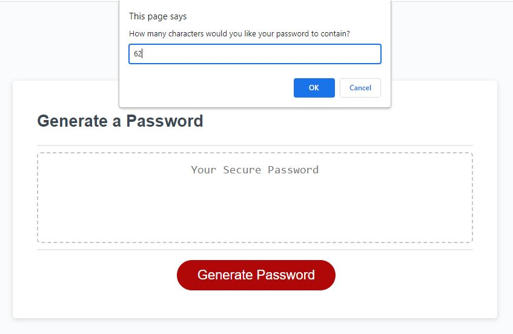
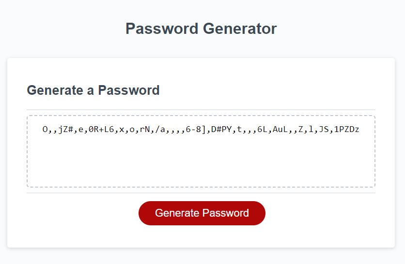

# Password Generator

## Description

My motivation for this task was to create a application that employees can use to generate a random password based on criteria they’ve selected.

It has a clean and polished user interface that is responsive to different wbe pages sizes. The app run's in the browser, and feature's dynamically updated HTML and CSS powered by JavaScript code that you write.

The generate password follows the follwing criteria: 

* Generate a password when the button is clicked
  * Present a series of prompts for password criteria
    * Length of password
      * At least 10 characters but no more than 64.
    * Character types
      * Lowercase
      * Uppercase
      * Numeric
      * Special characters ($@%&*, etc)
  * Code should validate for each input and at least one character type should be selected
  * Once prompts are answered then the password should be generated and displayed in an alert or written to the page

## Screenshot

The following image shows the web application's appearance and functionality:

## Links

https://marlenadowner.github.io/Java-Console-Finances/

https://github.com/MarlenaDowner/JavaScript-Password-Generator

## License

MIT License

Copyright (c) 2022 MIT License.

Permission is hereby granted, free of charge, to any person obtaining a copy of this software and associated documentation files (the "Software"), to deal in the Software without restriction, including without limitation the rights to use, copy, modify, merge, publish, distribute, sublicense, and/or sell copies of the Software, and to permit persons to whom the Software is furnished to do so, subject to the following conditions:

The above copyright notice and this permission notice shall be included in all copies or substantial portions of the Software.

THE SOFTWARE IS PROVIDED "AS IS", WITHOUT WARRANTY OF ANY KIND, EXPRESS OR IMPLIED, INCLUDING BUT NOT LIMITED TO THE WARRANTIES OF MERCHANTABILITY, FITNESS FOR A PARTICULAR PURPOSE AND NONINFRINGEMENT. IN NO EVENT SHALL THE AUTHORS OR COPYRIGHT HOLDERS BE LIABLE FOR ANY CLAIM, DAMAGES OR OTHER LIABILITY, WHETHER IN AN ACTION OF CONTRACT, TORT OR OTHERWISE, ARISING FROM, OUT OF OR IN CONNECTION WITH THE SOFTWARE OR THE USE OR OTHER DEALINGS IN THE SOFTWARE.
